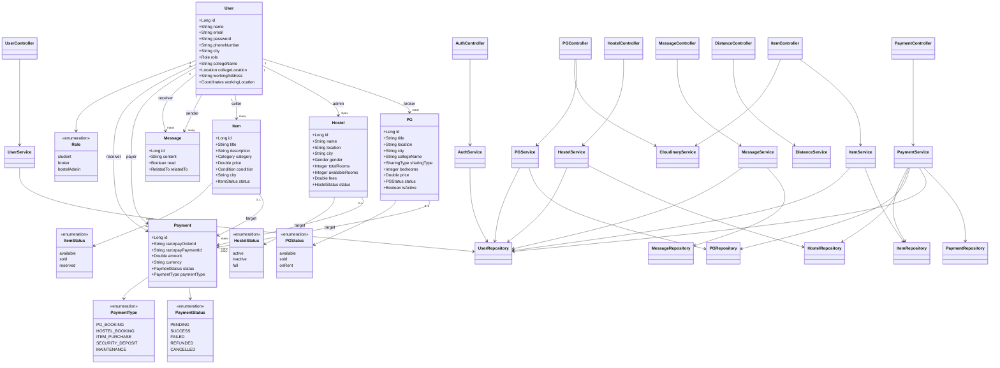

# Class Diagram (Mermaid)

This diagram is based on the current Spring Boot backend entities and key architectural classes.

```mermaid
classDiagram

class User {
  +Long id
  +String name
  +String email
  +String password
  +String phoneNumber
  +String city
  +Role role
  +String collegeName
  +Location collegeLocation
  +String workingAddress
  +Coordinates workingLocation
}

class PG {
  +Long id
  +String title
  +String location
  +String city
  +String collegeName
  +SharingType sharingType
  +Integer bedrooms
  +Double price
  +PGStatus status
  +Boolean isActive
}

class Hostel {
  +Long id
  +String name
  +String location
  +String city
  +Gender gender
  +Integer totalRooms
  +Integer availableRooms
  +Double fees
  +HostelStatus status
}

class Item {
  +Long id
  +String title
  +String description
  +Category category
  +Double price
  +Condition condition
  +String city
  +ItemStatus status
}

class Message {
  +Long id
  +String content
  +Boolean read
  +RelatedTo relatedTo
}

class Payment {
  +Long id
  +String razorpayOrderId
  +String razorpayPaymentId
  +Double amount
  +String currency
  +PaymentStatus status
  +PaymentType paymentType
}

class AuthController
class UserController
class PGController
class HostelController
class ItemController
class MessageController
class PaymentController
class DistanceController

class AuthService
class UserService
class PGService
class HostelService
class ItemService
class MessageService
class PaymentService
class DistanceService
class CloudinaryService

class UserRepository
class PGRepository
class HostelRepository
class ItemRepository
class MessageRepository
class PaymentRepository

class Role {
  <<enumeration>>
  student
  broker
  hostelAdmin
}

class PGStatus {
  <<enumeration>>
  available
  sold
  onRent
}

class HostelStatus {
  <<enumeration>>
  active
  inactive
  full
}

class ItemStatus {
  <<enumeration>>
  available
  sold
  reserved
}

class PaymentStatus {
  <<enumeration>>
  PENDING
  SUCCESS
  FAILED
  REFUNDED
  CANCELLED
}

class PaymentType {
  <<enumeration>>
  PG_BOOKING
  HOSTEL_BOOKING
  ITEM_PURCHASE
  SECURITY_DEPOSIT
  MAINTENANCE
}

User "1" --> "many" PG : broker
User "1" --> "many" Hostel : admin
User "1" --> "many" Item : seller
User "1" --> "many" Message : sender
User "1" --> "many" Message : receiver
User "1" --> "many" Payment : payer
User "1" --> "many" Payment : receiver

PG "0..1" --> "many" Payment : target
Hostel "0..1" --> "many" Payment : target
Item "0..1" --> "many" Payment : target

AuthController --> AuthService
UserController --> UserService
PGController --> PGService
PGController --> CloudinaryService
HostelController --> HostelService
ItemController --> ItemService
ItemController --> CloudinaryService
MessageController --> MessageService
PaymentController --> PaymentService
DistanceController --> DistanceService

AuthService --> UserRepository
UserService --> UserRepository
PGService --> PGRepository
PGService --> UserRepository
HostelService --> HostelRepository
HostelService --> UserRepository
ItemService --> ItemRepository
ItemService --> UserRepository
MessageService --> MessageRepository
MessageService --> UserRepository
PaymentService --> PaymentRepository
PaymentService --> UserRepository
PaymentService --> PGRepository
PaymentService --> HostelRepository
PaymentService --> ItemRepository

User --> Role
PG --> PGStatus
Hostel --> HostelStatus
Item --> ItemStatus
Payment --> PaymentStatus
Payment --> PaymentType
```
